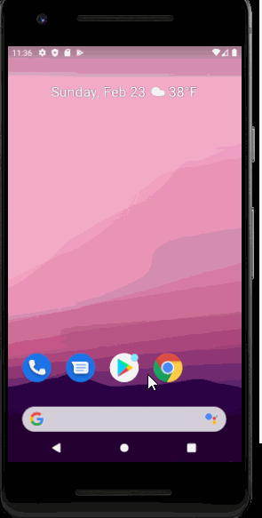

# Project - *Prescription Tracker*

Inspiration Prescription Tracker:
In a lot of places around the world, doctors use paper to write prescriptions for patients. We thought about what we can do to make this easier so we decided to build software we would make open source.

What it does Prescription Tracker?
It creates an interface for the doctor and another interface for the user. Both login using the same application with an option for the doctor to log in as a doctor and the patient as a patient on the startup page.

How we built it Prescription Tracker:
We built this app using android studio. We created sample API data to be displayed when a user searches. We wanted to create a search functionality from the API data but we didn’t have enough time so we focused on other parts of the project.

Challenges we ran into Prescription Tracker
We were working on different branches so when it came time to merge we had to look through our codes again and debug. That took us the most time. We also wanted to add more functionality to our app but we realized that we couldn’t finish in time if we added those. The other challenge was going from one activity to another in android app. It took a long time to figure out how to navigate from the second activity to the third activity.

Accomplishments that we're proud of Prescription Tracker
We are proud of our idea and how much we were able to understand and implement in a short time give. We are also proud of starting this project because we intend to finish it when we get back to campus.

What we learned Prescription Tracker
We learned how to use the android studio. We learned how to build an app. We learned how to use an API in our code. We learned more about the android studio debugging tools.

What's next for Prescription Tracker
We want to add a Barcode scanner, search functionality from an FDA API data (), and dispense our software open-source for doctors and patients to download and use it as they like. We would also like to add a functionality where patients press on medicine and can see the side effects and uses.

## Video Walkthrough

Here's a walkthrough of implemented user stories:

GIF created with [LiceCap](http://www.cockos.com/licecap/).

## Notes

#### Describe any challenges encountered while building the app.

I made an error with the capitalization when I wrote ItemAdapter so it took me a while to figure it our. 

## License

    Copyright [2020] [ Thy H. Nguyen - LEADER
    Liberty Mupotsa
    Sama Manalai
    Immanuela Belaineh]

    Licensed under the Apache License, Version 2.0 (the "License");
    you may not use this file except in compliance with the License.
    You may obtain a copy of the License at

        http://www.apache.org/licenses/LICENSE-2.0

    Unless required by applicable law or agreed to in writing, software
    distributed under the License is distributed on an "AS IS" BASIS,
    WITHOUT WARRANTIES OR CONDITIONS OF ANY KIND, either express or implied.
    See the License for the specific language governing permissions and
    limitations under the License.
